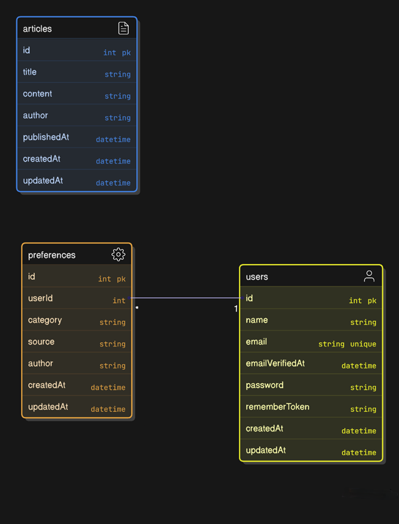

# 📰 News Aggregator API

A Laravel-based API project for managing news articles and user reading preferences.

---

## 📐 Architecture Overview

### ⚙️ Stack
- **Backend:** Laravel 10 (PHP 8.2)
- **Database:** PostgreSQL
- **Containerized:** Docker
- **Authentication:** Sanctum (token-based)
- **Documentation:** OpenAPI (Swagger via l5-swagger)

### 🧱 Directory Structure (Partial)
```
src/
├── app/
│   ├── Http/Controllers/      # API logic (Article, Preference, Auth)
│   └── Models/                # Eloquent models
├── database/
│   ├── migrations/            # Table schemas
├── routes/
│   └── api.php                # API route definitions
```

---

## 🗃️ Entity Relationship Diagram



---

## 🧩 Prisma Schema (Equivalent)

```prisma
model users {
  id           Int           @id @default(autoincrement())
  name         String
  email        String        @unique
  emailVerifiedAt DateTime? 
  password     String
  rememberToken String?
  preferences  preferences[]
  createdAt    DateTime      @default(now())
  updatedAt    DateTime      @updatedAt
}

model articles {
  id           Int       @id @default(autoincrement())
  title        String
  content      String
  author       String
  publishedAt  DateTime?
  createdAt    DateTime  @default(now())
  updatedAt    DateTime  @updatedAt
}

model preferences {
  id           Int      @id @default(autoincrement())
  user         users    @relation(fields: [userId], references: [id])
  userId       Int
  category     String?
  source       String?
  author       String?
  createdAt    DateTime @default(now())
  updatedAt    DateTime @updatedAt
}
```

---

## 🔌 API Endpoints

| Method | Endpoint                         | Description                        |
|--------|----------------------------------|------------------------------------|
| POST   | `/register`                      | Register new user                  |
| POST   | `/login`                         | User login                         |
| POST   | `/logout`                        | Logout (Sanctum protected)         |
| GET    | `/articles`                      | List all articles                  |
| POST   | `/articles`                      | Create article                     |
| GET    | `/feed/personalized`    | Personalized article feed          |
| PUT    | `/articles/{id}`                 | Update article                     |
| DELETE | `/articles/{id}`                 | Delete article                     |
| GET    | `/preferences`                   | Get user preferences               |
| POST   | `/preferences`                   | Save new preferences               |
| PUT    | `/preferences/{id}`              | Update preferences                 |
| DELETE | `/preferences/{id}`              | Delete preferences                 |
| POST   | `/forgot-password`               | Initiate password reset            |
| POST   | `/reset-password`                | Perform password reset             |

---

## 🐳 Docker Setup

```yaml
# docker-compose.yml

services:
  app:
    build:
      context: .
      dockerfile: Dockerfile
    image: laravel-app
    ports:
      - "8000:8000"
    environment:
      - DB_CONNECTION=pgsql
      - DB_HOST=db
      - DB_PORT=5432
      - DB_DATABASE=laravel
      - DB_USERNAME=laravel
      - DB_PASSWORD=secret

  db:
    image: postgres:15
    environment:
      POSTGRES_DB: laravel
      POSTGRES_USER: laravel
      POSTGRES_PASSWORD: secret
    ports:
      - "5432:5432"

volumes:
  pgdata:
```

---

## ▶️ Local Development

```bash
docker-compose up --build
# Access at: http://localhost:8000
```
